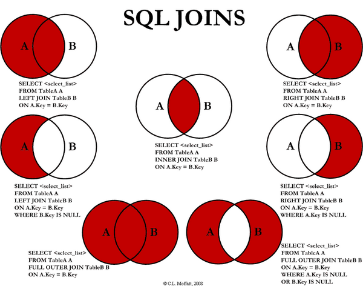

# SQL 학습

## 0. 용어설명
- DB: 데이터 저장소
- DBMS: DataBase Management System - 데이터베이스 관리 시스템
- RDB: Relational DataBase - 관계형 데이터베이스 ( MySQL, Oracle, MSSQL )
- DBMS Client Tool: MySQL, Heidi, Workbench
- NoSQL: Not Only SQL - 데이터를 테이블에 저장하지 않고 json형태로 저장한다. ( firebase, mongoDB )
- SQL: Structured Query Language - RDBMS에서 사용하는 언어
- ORM: Object Relational Mapping - 객체 관계매핑 ( SQL(sequalize), NOSQL( Mongoose ) )
- CLI program: Command Line Interface program - cmd창에서 쓰는 프로그램 ( firebase, git, npm, mysql, node )

## 1. Database
### database 명령어
```sql
-- database 만들기
CREATE TABLE shop DEFAULT CHARACTER SET utf8;

-- database 보기
SHOW databases;

-- database 사용하기
USE shop;
```

### table 명령어
```sql
-- table 만들기
CREATE TABLE `test` (
	`id` int(11) NOT NULL,
	`name` varchar(255) NOT NULL, 
	PRIMARY KEY (`id`)
) DEFAULT CHARSET=utf8;

CREATE TABLE `users2` (
	`id` INT(11) NOT NULL AUTO_INCREMENT,
	`username` VARCHAR(255) NOT NULL,
	`userid` VARCHAR(255) NOT NULL,
	`userpw` VARCHAR(255) NOT NULL,
	PRIMARY KEY (`id`)
) COLLATE='utf8mb4_0900_ai_ci';

-- table 보기
SHOW TABLES;

-- table 삭제
DROP TABLE tablename;
```

### record 명령어 ( HeidiSQL의 query, JavaScript에서 작성하는 명령 )
```sql
-- CRUD
-- Create : INSERT
-- INSERT INTO 테이블명 SET 필드명1=값1, 필드명2=값2 ...
-- INSERT INTO 테이블명 (필드명1, 필드명2, 필드명3 ...) VALUES (값1, 값2, 값3 ...)
INSERT INTO users SET username='홍길동', userid='hong', userpw='1234';
INSERT INTO users (username, userid, userpw) VALUES ('홍길순', 'hong2', '1234');

-- Update: UPDATE
-- 조건절이 꼭 들어가야 한다(안그러면 박스구하러 가야한다)
-- UPDATE 테이블명 SET 필드명1=값1, 필드명2=값2 WHERE id=1;
UPDATE users SET userpw='1234' WHERE id=1;

-- Delete: DELETE
-- 조건절이 꼭 들어가야 한다(안그러면 박스구하러 가야한다)
-- DELETE FROM 테이블명 WHERE id=2;
DELETE FROM users WHERE id=2;

-- Read: SELECT
-- 제일 복잡하다. 차차 배워나가자.
SELECT * FROM employee;		-- 모든 필드를 가져옴
SELECT id, eno... FROM employee;		-- 내가 지정한 필드만 가져옴
SELECT COUNT(id) FROM employee;		-- 내가 지정한 필드의 행의 갯수를 가져옴
SELECT * FROM employee ORDER BY id DESC;		-- id를 내림차순으로 가져옴
SELECT * FROM employee ORDER BY id ASC;		-- id를 오름차순으로 가져옴
SELECT * FROM employee WHERE id=2;		-- id가 2인 행을 가져옴
SELECT * FROM employee WHERE id>2;		-- id가 2보다 큰 행을 가져옴
SELECT * FROM employee WHERE id>2 ORDER BY id DESC;		-- id가 2보다 큰 행을 내림차순으로 가져옴
SELECT * FROM employee WHERE id>=2 ORDER BY id DESC;		-- id가 2와 같거나 큰 행을 내림차순으로 가져옴
SELECT * FROM pay WHERE pay>=3000000 AND pay<5000000 ORDER BY pay ASC;		-- pay가 3백이상 5백미만인 행을 오름차순으로 가져옴
SELECT * FROM info WHERE tel='010';		-- tel 이 010인 행을 가져옴(데이터 없음)
SELECT * FROM info WHERE tel LIKE '010';		-- 위와같음
SELECT * FROM info WHERE tel LIKE '010%';		-- tel이 010으로 시작하는 행을 가져옴
SELECT * FROM info WHERE tel LIKE '%0001';		-- tel이 0001 로 끝나는 행을 가져옴
SELECT * FROM info WHERE tel LIKE '%0000%';		-- tel이 0000 을 포함하는 행을 가져옴(앞 뒤에 뭐가 있든 0000만 포함하면 가져온다)
SELECT * FROM pay WHERE pay >= 2000000 ORDER BY pay DESC;
SELECT * FROM pay WHERE pay >= 2000000 ORDER BY pay DESC LIMIT 0, 3;
SELECT * FROM pay WHERE pay >= 2000000 ORDER BY pay DESC, id ASC;	-- pay가 3백 이상인 행을 내림차순으로 정렬하고 pay값이 같은 행들을 id 오름차순으로 다시 정렬
SELECT * FROM pay WHERE pay >= 2000000 ORDER BY pay DESC, id ASC LIMIT 0, 3;	-- pay 3백 이상인 행을 내림차순으로 정렬후 pay가 같은 행들을 id 오름차순으로 재정렬 후 0번자리부터 상위 3개를 불러옴
SELECT * FROM pay WHERE pay >= 2000000 ORDER BY pay DESC, id ASC LIMIT 3, 3;	-- 3번자리부터 상위 3개를 불러옴(3등 ~ 5등 까지를 가져옴: INDEX개념)


-- UPDATE, DELETE => WHERE절 필수
-- SELECT => WHERE, ORDER, LIMIT 순으로 작성한다. (원하는 조건(WHERE)을 추려서 정렬(OPDER)시킨 후 원하는 데이터만(LIMIT) 가져온다)
-- SELECT => WHERE절		-- WHERE 행이름 (가져올 행)
-- SELECT => ORDER절		-- ORDER BY 테이블명 DESC or ASC
-- SELECT => LIMIT절		-- LIMIT 시작 레코드 IDX, 가져올 개수
```

---
### record 명령어 (중급)



```sql
-- 두개의 테이블 합쳐서 가져오기
SELECT employee.*, info.id AS infoid, info.gender, info.age, info.tel FROM employee LEFT JOIN info ON employee.id = info.eid;
		-- employee에 info를 붙여서(employee LEFT JOIN info), employee의 id와 info의 eid가 같은 행만(ON employee.id = info.eid) 가져온다 (WERE, ORER, LIMIT 다 쓸수 있음)
SELECT employee.*, info.id AS infoid, info.gender, age, tel FROM employee JOIN info ON employee.id = info.eid WHERE info.tel LIKE '%0000%' ORDER BY employee.id ASC LIMIT 0, 3;
		-- employee에 info를 붙여서, employee의 id와 info의 eid가 같은 행만 가져오는데, info.tel에 0000이 들어있는 것들을 오름차순 정렬하여 위에서 3개만 가져온다.

-- 1 : 1 관계
SELECT A.*, B.id AS infoid, B.gender, age, tel 
FROM employee A JOIN info B 		-- employee를 A로, info를 B로 이름을 바꿔줌
ON A.id = B.eid 
WHERE B.tel LIKE '%0000%' 
ORDER BY A.id ASC 
LIMIT 0, 3;

SELECT A.*, B.id AS payid, pay, payAt 		-- B의 id라는 항목명을 payid로 바꿔줌
FROM employee A JOIN pay B 		-- employee를 A로, pay를 B로 이름을 바꿔줌
ON A.id = B.eid 
WHERE B.pay >= 3000000 
ORDER BY A.id ASC 
LIMIT 0, 10;


-- SELECT => JOIN절
-- SELECT => AS절: B.id AS payid (B의 id라는 항목명을 payid로 바꿔줌)

```